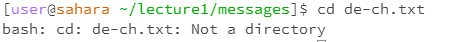

So that’s 9 total examples (3 for each command). For each, include:

A screenshot or Markdown code block showing the command and its output
What the working directory was when the command was run
A sentence or two explaining why you got that output (e.g. what was in the filesystem, what it meant to have no arguments).
Indicate whether the output is an error or not, and if it’s an error, explain why it’s an error.

# Lap Report 1

## Using the commands with no arguments:

**cd:**
 <-- template, upload png to github repository then replace imageName.png with the name of the file in your repository. 
Nothing occured because there was no directory listed as an argument to change to.

**ls:**

No other directories or folders such as messages showed up because those are in the lecture1 directory, but I was in the home directory which only contains the lecture1 folder that was listed.

**cat:**

There is no argument for the cat command to catenate, so it does nothing instead.

## Using the commands with a path to a directory as an argument:

**cd:**

Providing a directory as an argument gave the cd command a location to switch the working directory to.

**ls:**

Because the lecture1 directory contains the files and folde in the picture, those were the ones listed when lecture1 was provided as an argument.

**cat:**

Directories have no content to output themselves since they're intangible spaces that store other files. As a result, the command just tells us that the argument is a directory because the folder contains no other content.

## Using the commands with a path to a file as an argument:

**cd:**

The cd command only works with directories, so providing a file as an argument throws an exception.

**ls:**

A file cannot contain another file, so just providing one as an argument will cause it to list only itself.

**cat:**

"Hallow Welt!" appears in the temrinal because the cat command is grabbing the contents of the txt file and outputting it as text in the terminal.
