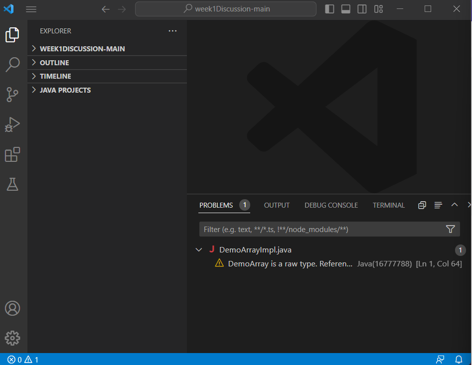
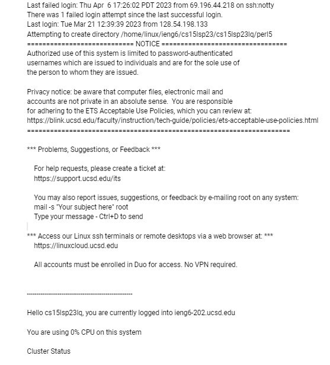

Personally, I already had VS Code on my personal computer before this lab, but to download it, you just got to their website and download the right version for your computer. It's also important to download bash for VS Code and install it so that it appears as an option in VS Code's terminal options.

In order to login, you open up that bash terminal and input the following code (without the dollar sign)
$ ssh cs15lsp23zz@ieng6.ucsd.edu // The zz in this code is replaced by the letters in your course account which you can find through the UCSD website.
Then, you just need to input your password for your CSE15l account and you should be in, otherwise, you may need to reset your password.

In order to test commands, you continue to type in the terminal as normal after login. In this instance, I tried a command that just gave me the current directory.
